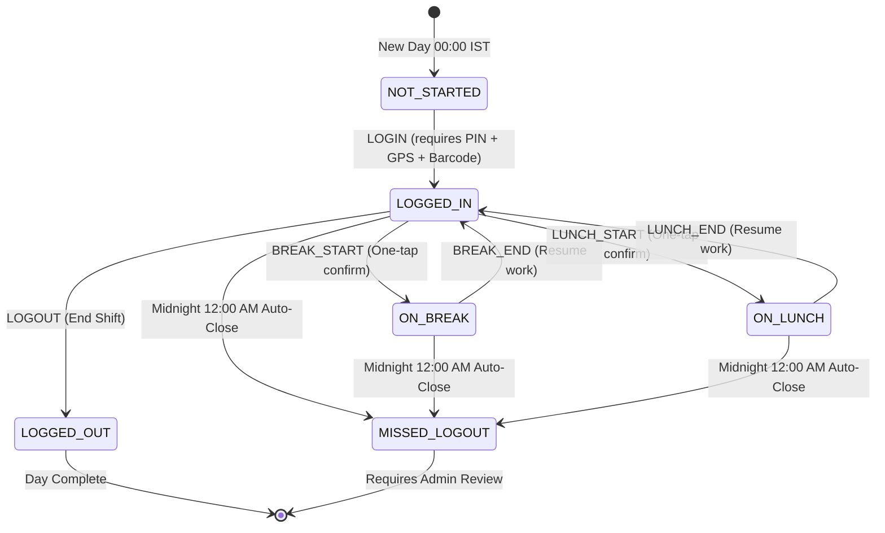

# SS40 NETWORK — Employee Attendance Management System
## Complete Technical Specification, Architecture, and Operational Guide

---

# 1. Executive Summary & Objective

The **SS40 Network Employee Attendance Management System** is an enterprise-grade web and mobile platform designed to track employee attendance, shift timings, tea/coffee breaks, and lunch hours with mathematical accuracy and strict anti-proxy verification.

### Core Objectives:
1. **Zero Proxy / Buddy Punching**: Enforce a 4-pillar security verification model (**GPS Geofencing** + **Physical ID Barcode Scan** + **1:1 Device Binding** + **4-Digit Security PIN**).
2. **Network Agnostic Physical Verification**: Avoid fragile dynamic IP dependencies (ISP dynamic re-leasing, power cuts) by using high-precision **Haversine GPS Geofencing**.
3. **Frictionless Intra-Day UX**: Employees enter their PIN only once during morning login; intra-day actions (*Take Break*, *Go to Lunch*, *Resume*, *Log Out*) use one-tap confirmation modals without re-prompting for PINs.
4. **Real-time Operational Monitoring**: Live administrative dashboard showing instant employee state transitions without manual browser refreshes.
5. **Event-Sourced Audit History & Automated Reconciliation**: Track every individual transition timestamp while generating summarized daily sessions and auto-closing missing logouts at 12:00 AM IST.
6. **Executive Excel Reports**: Generate formatted `.xlsx` spreadsheets calculating gross work hours, break durations, lunch intervals, and late arrivals.

---

# 2. System Architecture & High-Level Flow

```
┌─────────────────────────────────────────────────────────────────────────────────┐
│                           SS40 ATTENDANCE ECOSYSTEM                             │
└─────────────────────────────────────────────────────────────────────────────────┘

   ┌────────────────────────┐                   ┌───────────────────────────────┐
   │  EMPLOYEE SMARTPHONE   │                   │     ADMIN COMMAND CENTER      │
   │  (Responsive PWA / Web)│                   │   (Live Ops Monitoring Board) │
   └───────────┬────────────┘                   └───────────────┬───────────────┘
               │                                                │
               │ HTTPS (REST / WebSockets)                      │ Realtime Stream
               ▼                                                ▼
   ┌────────────────────────────────────────────────────────────────────────────┐
   │                       NEXT.JS FULL-STACK BACKEND ENGINE                    │
   │                                                                            │
   │  ┌──────────────────────┐  ┌───────────────────────┐  ┌─────────────────┐  │
   │  │  Geofence Evaluator  │  │  State Machine Guard  │  │  Device Binding │  │
   │  │ (Haversine Formula)  │  │  (Valid Transitions)  │  │  Token Manager  │  │
   │  └──────────────────────┘  └───────────────────────┘  └─────────────────┘  │
   └─────────────────────────────────────┬──────────────────────────────────────┘
                                         │
                                         ▼
   ┌────────────────────────────────────────────────────────────────────────────┐
   │                  DATABASE LAYER (PostgreSQL / Supabase)                    │
   │                                                                            │
   │  ┌──────────────────────┐  ┌───────────────────────┐  ┌─────────────────┐  │
   │  │  attendance_sessions │  │   attendance_events   │  │    employees    │  │
   │  │   (Daily Aggregate)  │  │   (Raw Audit Trail)   │  │  (Bound Tokens) │  │
   │  └──────────────────────┘  └───────────────────────┘  └─────────────────┘  │
   └────────────────────────────────────────────────────────────────────────────┘
```

---

# 3. The 4-Pillar Anti-Proxy Security Stack

```
   Pillar 1: GPS Geofence          Pillar 2: Physical ID Scan
   ┌───────────────────────┐       ┌────────────────────────┐
   │ Haversine validation  │       │ Camera scans barcode   │
   │ within 100m of office │  ──▶  │ on physical badge card │
   └───────────────────────┘       └────────────────────────┘
               │                               │
               ▼                               ▼
   Pillar 3: Device Binding        Pillar 4: 4-Digit PIN
   ┌───────────────────────┐       ┌────────────────────────┐
   │ 1 Phone = 1 Employee  │       │ Employee enters secret │
   │ Hardware UUID lock    │  ──▶  │ PIN for morning login  │
   └───────────────────────┘       └────────────────────────┘
```

### Pillar 1: High-Precision GPS Geofencing
- The mobile browser requests high-accuracy coordinates (`navigator.geolocation.getCurrentPosition`).
- The backend evaluates distance against the configured office coordinates using the **Haversine Formula**:
  $$d = 2R \arcsin\left(\sqrt{\sin^2\left(\frac{\Delta \phi}{2}\right) + \cos(\phi_1)\cos(\phi_2)\sin^2\left(\frac{\Delta \lambda}{2}\right)}\right)$$
- If the employee is further than the allowed threshold (default $100$ meters), access to the scanner is locked.

### Pillar 2: Physical ID Badge Barcode Scan
- The phone camera opens a live viewport powered by `html5-qrcode` / `@zxing/library`.
- The employee aligns their physical ID card's 1D Barcode (e.g. `SS40-EMP-8F73K2`) or QR code.
- Plain text employee details are never encoded into the barcode; only an opaque token is stored.

### Pillar 3: 1:1 Hardware Device Binding Token
- On initial launch, a cryptographically secure UUID (`ss40_device_uuid`) is generated and stored in the phone's `localStorage`.
- **First Scan**: The backend binds this `device_token` to the employee record.
- **Subsequent Scans**:
  - If a coworker attempts to scan another employee's badge on their device $\rightarrow$ **Blocked (Device Conflict: Buddy punching prevented)**.
  - If an employee attempts to scan from an unapproved phone $\rightarrow$ **Blocked (Unauthorized Device)**.
- **Admin Reset**: If an employee changes or loses their phone, the admin can click **"Reset Device"** in the Admin Directory with one tap.

### Pillar 4: 4-Digit Security PIN Authentication
- During morning punch-in (`LOGIN`), the employee enters their personal 4-digit PIN (default `1234`).
- Once authenticated into the `LOGGED_IN` state, intra-day actions do not ask for the PIN again.

---

# 4. State Machine & Transition Rules

To prevent state corruption and tampering, the backend enforces a server-authoritative finite state machine:



### Transition Table:
| Current Status | Allowed Action | Resulting Status | PIN Required? |
| :--- | :--- | :--- | :--- |
| `NOT_STARTED` | `LOGIN` | `LOGGED_IN` | **Yes (4-digit PIN)** |
| `LOGGED_IN` | `BREAK_START` | `ON_BREAK` | No (Confirmation modal) |
| `LOGGED_IN` | `LUNCH_START` | `ON_LUNCH` | No (Confirmation modal) |
| `LOGGED_IN` | `LOGOUT` | `LOGGED_OUT` | No (Confirmation modal) |
| `ON_BREAK` | `BREAK_END` | `LOGGED_IN` | No (Confirmation modal) |
| `ON_LUNCH` | `LUNCH_END` | `LOGGED_IN` | No (Confirmation modal) |
| `LOGGED_OUT` | *(None - shift finalized)* | `LOGGED_OUT` | — |
| `MISSED_LOGOUT` | *(Auto-closed at midnight)* | `MISSED_LOGOUT` | — |

---

# 5. Database Schema & Dual-Layer Event Sourcing

The database architecture separates **daily summary aggregates** (`attendance_sessions`) from **immutable audit events** (`attendance_events`).

### 1. `offices`
- `id` (String / UUID, PK)
- `name` (String, e.g. "SS40 Network Main Office")
- `address` (String)
- `latitude` (Float, e.g. 12.9716)
- `longitude` (Float, e.g. 77.5946)
- `radius_meters` (Int, e.g. 100)
- `timezone` (String, default "Asia/Kolkata")
- `status` (Enum: ACTIVE | INACTIVE)

### 2. `departments`
- `id` (String, PK)
- `name` (String, e.g. "Software Engineering")
- `code` (String, e.g. "DEV")

### 3. `employees`
- `id` (String / UUID, PK)
- `employee_code` (String, e.g. "SS40-001")
- `name` (String)
- `email` (String, unique)
- `phone` (String)
- `department_id` (FK $\rightarrow$ departments.id)
- `designation` (String)
- `barcode_value` (String, unique, e.g. "SS40-EMP-8F73K2")
- `pin` (String, 4 digits)
- `device_token` (String, nullable, UUID)
- `device_model` (String, nullable)
- `status` (Enum: ACTIVE | INACTIVE)
- `joined_at` (Date)
- `created_at` (Timestamp)

### 4. `attendance_sessions` (Daily Aggregates)
- `id` (String, PK, e.g. "sess-emp001-2026-09-21")
- `employee_id` (FK $\rightarrow$ employees.id)
- `office_id` (FK $\rightarrow$ offices.id)
- `attendance_date` (String, YYYY-MM-DD in Asia/Kolkata)
- `status` (Enum: NOT_STARTED, LOGGED_IN, ON_BREAK, ON_LUNCH, LOGGED_OUT, MISSED_LOGOUT)
- `login_at` (Timestamp, nullable)
- `logout_at` (Timestamp, nullable)
- `total_work_minutes` (Int, default 0)
- `total_break_minutes` (Int, default 0)
- `total_lunch_minutes` (Int, default 0)
- `is_late` (Boolean, default false)
- `late_minutes` (Int, default 0)
- `is_missed_logout` (Boolean, default false)
- `created_at` (Timestamp)
- `updated_at` (Timestamp)

### 5. `attendance_events` (Immutable Audit Log)
- `id` (String, PK)
- `session_id` (FK $\rightarrow$ attendance_sessions.id)
- `employee_id` (FK $\rightarrow$ employees.id)
- `event_type` (Enum: LOGIN, BREAK_START, BREAK_END, LUNCH_START, LUNCH_END, LOGOUT, AUTO_CLOSE_MIDNIGHT, MANUAL_CORRECTION)
- `event_time` (Timestamp with timezone)
- `latitude` (Float, nullable)
- `longitude` (Float, nullable)
- `device_token` (String, nullable)
- `notes` (String, nullable)
- `created_at` (Timestamp)

---

# 6. REST API Reference

### 1. `POST /api/attendance/verify-location`
Evaluates employee GPS coordinates against office boundary.
* **Payload**: `{ "latitude": 12.9716, "longitude": 77.5946 }`
* **Response**:
  ```json
  {
    "success": true,
    "isInside": true,
    "distanceMeters": 14,
    "allowedRadiusMeters": 100,
    "office": { "name": "SS40 Network Main Office" }
  }
  ```

### 2. `POST /api/attendance/scan-identify`
Looks up employee by scanned barcode token and checks device binding.
* **Payload**: `{ "barcodeValue": "SS40-EMP-8F73K2", "deviceToken": "dev-uuid-xxx", "deviceModel": "iPhone 15" }`
* **Response**:
  ```json
  {
    "success": true,
    "employee": { "id": "emp-001", "name": "Abraham Samuel", "employeeCode": "SS40-001" },
    "currentStatus": "NOT_STARTED",
    "allowedActions": ["LOGIN"],
    "requiresPin": true
  }
  ```

### 3. `POST /api/attendance/action`
Executes state machine transition.
* **Payload**: `{ "employeeId": "emp-001", "action": "LOGIN", "pin": "1234", "latitude": 12.9716, "longitude": 77.5946 }`
* **Response**:
  ```json
  {
    "success": true,
    "message": "Action 'LOGIN' recorded successfully!",
    "status": "LOGGED_IN",
    "session": { "totalWorkMinutes": 0, "totalBreakMinutes": 0 }
  }
  ```

### 4. `GET /api/attendance/live`
Fetches real-time status of all employees and aggregate KPIs for the Admin Dashboard.

### 5. `POST /api/attendance/cron-midnight`
Reconciles unclosed shifts at 12:00 AM IST and flags them as `MISSED_LOGOUT`.

### 6. `GET /api/reports/export-excel`
Downloads a formatted `.xlsx` workbook containing complete daily attendance calculations.

---

# 7. Step-by-Step User Journeys

### A. Employee Daily Routine:
1. **Arrival**: Employee reaches the office and opens `http://localhost:3001/attendance` on their mobile phone.
2. **Geofence Check**: App displays the **Geofence Radar** verifying they are within 100m of the office.
3. **Badge Scan**: Employee taps **"Open ID Barcode Scanner"** and points the camera at their physical ID card.
4. **Device Check**: Backend confirms the device UUID belongs to this employee.
5. **PIN Login**: Employee enters their 4-digit PIN $\rightarrow$ Confetti animation fires $\rightarrow$ Status changes to `LOGGED_IN`.
6. **Tea / Coffee Break**: Employee taps `[ Take Break ]` $\rightarrow$ Confirms in modal $\rightarrow$ Status changes to `ON_BREAK` (work timer pauses).
7. **Resume Work**: Employee taps `[ Resume Work from Break ]` $\rightarrow$ Status changes back to `LOGGED_IN`.
8. **Lunch Hour**: Employee taps `[ Go for Lunch ]` $\rightarrow$ Lunch timer starts $\rightarrow$ Returns via `[ Resume Work from Lunch ]`.
9. **Shift Departure**: Employee taps `[ End Shift & Log Out ]` $\rightarrow$ Confirms $\rightarrow$ Daily record finalized with total work hours.

### B. Admin Daily Routine:
1. **Live Monitoring**: Admin opens `http://localhost:3001/admin` on desktop/tablet to view live active counters (Logged In, On Break, On Lunch, Logged Out).
2. **Employee Registration**: Admin clicks **"Add New Employee"**; system generates unique barcode identifier (`SS40-EMP-XXXXXX`) and assigns a PIN.
3. **ID Badge Printing**: Admin clicks **"Print Badge"** to generate a printable ID badge with authentic SVG barcode bars.
4. **Device Management**: If an employee gets a new phone, Admin clicks **"Reset Device"** to clear the old binding.
5. **Excel Export**: Admin clicks **"Export Excel"** to download the official audit report.

---

# 8. Local Setup & Production Deployment Runbook

### Local Development:
```bash
# 1. Navigate to project root
cd "c:\SS40 NETWORK\Attendance Register"

# 2. Install dependencies (if not already installed)
npm install

# 3. Launch Development Server
npm run dev
# Running on http://localhost:3001
```

### Production Deployment (Vercel + Supabase):
1. **Database**: Create a project on [Supabase.com](https://supabase.com).
2. **Schema Migration**: Connect Prisma or run schema migrations against the Supabase PostgreSQL connection string.
3. **Realtime**: Enable Supabase Realtime broadcast on `attendance_sessions` and `attendance_events` tables.
4. **Frontend Deployment**: Push repository to GitHub and connect to [Vercel](https://vercel.com).
5. **Environment Variables**:
   - `DATABASE_URL`: Supabase PostgreSQL URL
   - `NEXT_PUBLIC_SUPABASE_URL`: Supabase project URL
   - `NEXT_PUBLIC_SUPABASE_ANON_KEY`: Supabase public anon key
